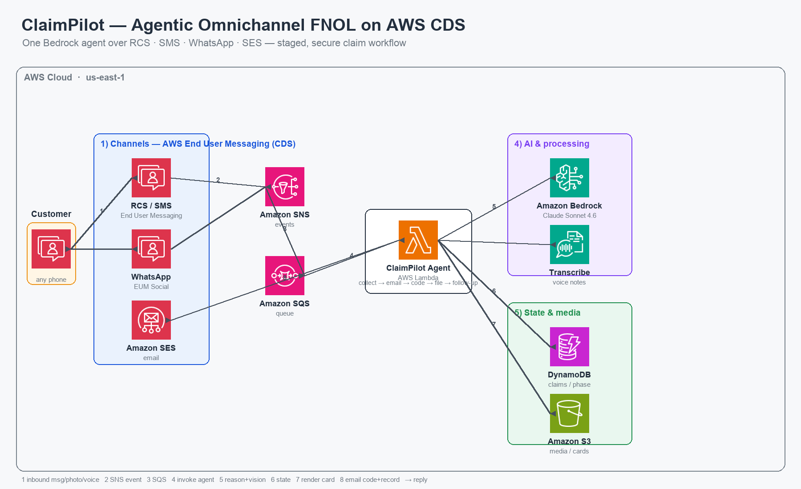

# ClaimPilot — Agentic FNOL Insurance Claims over AWS CDS

**AWS Communication Developer Services (CDS) Agentic AI Partner Hackathon**

ClaimPilot turns insurance First Notice of Loss (FNOL) from a slow phone/portal
process into a claim filed, triaged, and confirmed in minutes — entirely inside
the customer's messaging app. A policyholder messages the agent, and an AI
conversation (Amazon Bedrock) collects what/when/where/damage, understands photos
and voice notes, generates a claim number, and sends back a branded confirmation
card. The **same agent** runs over **RCS** and **WhatsApp**.

## Architecture



*Built from the official AWS Architecture Icons — regenerate with `python3 infra/diagram/make_architecture.py`.*

### Staged, secure workflow (5 phases)

```
collecting ──▶ awaiting_email ──▶ awaiting_code ──▶ filed ──▶ followup
```

1. **collecting** — Customer messages over **RCS / SMS / WhatsApp**. AWS End User
   Messaging stores any attachment in **S3** and publishes an event to **SNS → SQS**.
   The **Lambda** consumes it; `media.py` turns attachments into text (images →
   **Bedrock vision**, voice → **Amazon Transcribe**); `claim_agent.py` (**Claude
   Sonnet 4.6**) collects the slots `what/when/where/damage`. State in **DynamoDB**.
2. **awaiting_email** — Once slots are complete, the agent does not file yet — it
   asks for the customer's email to authorize the claim.
3. **awaiting_code** — A **6-digit code is emailed via Amazon SES**. The customer
   replies with it in chat (secure consent gate; wrong codes re-prompt / resend).
4. **filed** — On a correct code, a **claim number** (`CLM-XXXXXX`) is issued, a
   **simulated settlement** (estimate − deductible = payout) is computed, and the
   customer receives the claim number + settlement on their **messaging channel**
   (text + compact rich card) **and** a formal **SES confirmation email**.
5. **followup** — Post-filing, the agent helps schedule an adjuster and choose a
   repair shop / rental by location (omnichannel; WhatsApp-friendly).

> Full phase details and end-to-end test steps: [`tools/rcs_agent/README.md`](tools/rcs_agent/README.md)

## The agent is channel-agnostic

One brain, two transports. `channels.py` provides adapters with a shared interface
(`parse`, `send_text`, `send_confirmation`):

| Concern | RCS | WhatsApp |
|---|---|---|
| Service | AWS End User Messaging (SMS/RCS) | AWS End User Messaging Social |
| Inbound event | SNS `cds-eum-events` → SQS | SNS `cds-whatsapp-events` → SQS |
| Send API | `SendRcsMessage` / `SendTextMessage` | `SendWhatsAppMessage` |
| Rich confirmation | RCS rich card + image + suggestions | image message + caption |

Everything else — the Bedrock agent, media handling, vision/transcription, claim
generation, DynamoDB state — is shared. Adding a channel = adding one adapter.

## Multi-modal input

Nothing gets dropped. `media.py` routes by MIME type:

| Attachment | Handling |
|---|---|
| Image | Amazon Bedrock vision → damage assessment + fraud signal (fills `damage`) |
| Audio / voice note | Amazon Transcribe → transcript used as the customer's turn |
| Video | Acknowledged; agent asks for a clear still photo if needed |
| PDF / document | Acknowledged (e.g., police report / estimate), attached to claim |
| Contact (vCard) | Acknowledged (other driver / witness) |
| Other | Graceful acknowledgment; conversation continues |

## AWS resources

| Resource | Name |
|---|---|
| Lambda | `claimpilot-rcs-agent` (python3.12, arm64, Pillow bundled) |
| IAM role | `claimpilot-rcs-agent-role` (Bedrock, sms-voice, social-messaging, Transcribe, S3, DynamoDB, SQS, logs) |
| DynamoDB | `claimpilot-claims` (key `phone` = `channel:number`) |
| S3 | `claimpilot-rcs-media-<account>` (`inbound/` media, `confirmations/` cards) |
| RCS agent | `rcs-f9a76b2b8448418fb9ae6747622beaa6` (TESTING) |
| WhatsApp | WABA `FNOL-Claim`, sender `+1 408-462-1873` |
| Bedrock model | `us.anthropic.claude-sonnet-4-6` |

## Repository layout

```
tools/rcs_agent/
├── lambda_function.py     # channel-agnostic handler (SQS → agent → reply)
├── channels.py            # RCS + WhatsApp adapters (parse / send)
├── claim_agent.py         # Bedrock FNOL slot-filling brain + vision + claim number
├── media.py               # image vision, audio transcription, doc handling
├── confirmation_image.py  # branded claim card (Pillow) → S3
└── deploy.sh              # idempotent deploy (table, role, Lambda, both SQS sources)

infra/
├── rcs/                   # RCS brand assets + testing-agent registration scripts
└── whatsapp/              # WhatsApp UTILITY template (claim_started)

scripts/
├── awscds.sh              # AWS CLI wrapper (working binary + clean creds)
└── check_template_status.sh

docs/
├── CLAIMPILOT_BUILD_PLAN.md
├── AWS_CDS_SETUP_AND_TESTING.md
├── HACKATHON_IDEAS.md
└── BEDROCK_MODEL_ACCESS_SUPPORT_TICKET.md
```

## Deploy

```bash
./tools/rcs_agent/deploy.sh
```

Idempotent: creates/updates the DynamoDB table, IAM role, Lambda (with a bundled
Pillow wheel for arm64), and wires both the RCS and WhatsApp SQS event sources.
All AWS CLI calls go through `scripts/awscds.sh`.

## Try it

- **RCS:** message the ClaimPilot agent from a registered test device. Send text,
  a damage photo, or a voice note — the agent replies and files the claim.
- **WhatsApp:** message the FNOL-Claim business number (`+1 408-462-1873`). Inside
  the 24-hour window the agent replies free-form; business-initiated outreach uses
  the approved `claim_started` UTILITY template.

Watch it live:

```bash
./scripts/awscds.sh logs tail /aws/lambda/claimpilot-rcs-agent --follow --region us-east-1
```

## Notes

- Region: `us-east-1`. Account tier is currently SANDBOX (spend limits apply).
- RCS testing agents send only to registered/verified test devices — sufficient for
  the demo. Production reach requires a country-launch registration (carrier approval).
